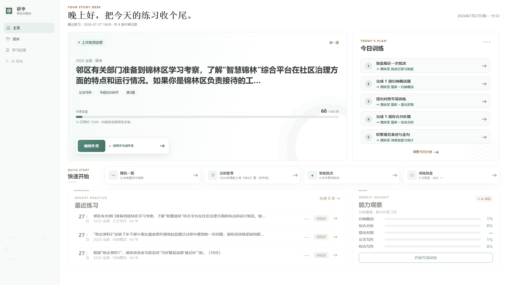

# 研申



面向 Windows 的本地申论练习应用，内置国考、省考和选调申论试卷。支持试卷检索、材料阅读、作答记录、批注、收藏、训练统计、智能批改和 AI 训练复盘。

## 下载与使用

1. 在仓库右侧打开 **Releases**，下载最新的 `gongkao-shenlun-v*-windows-x64.zip`。
2. 完整解压 ZIP，双击 `研申.exe`。
3. 应用默认进入主页；关闭窗口后本地服务会自动退出。

应用无需安装 Python 或 Edge 浏览器，但 Windows 需要 [Microsoft WebView2 Runtime](https://developer.microsoft.com/microsoft-edge/webview2/)。个人数据保存在 `%LOCALAPPDATA%\GongkaoShenlun`，更新版本时直接替换程序目录即可。

## 主要功能

- 按试卷、地区、年份、题型、状态、关键词和答案来源筛选
- 阅读整卷材料并定位题目引用范围
- 作答草稿自动保存，多次作答可继续修改
- 材料高亮、文本批注、收藏和个人笔记
- 参考答案对比、训练统计和数据导入导出
- 粉笔套卷 URL 自动导入：首次粘贴 Cookie-Editor 的粉笔 Cookie，之后批量输入 URL 即可抓取完整材料、题目和候选参考答案
- 基于本题参考答案共识、材料依据和个人历史的智能批改
- 逐点纠错、评分重算与 AI 训练复盘

macOS 版本和粉笔导入的完整使用、署名与资源打包说明见 [粉笔套卷 URL 导入与 macOS 版本说明](docs/url-import-macos.md)。macOS 必须下载完整的 `研申.app` 压缩包，不能只下载其中的可执行文件。

## 智能批改

配置方法见 [DeepSeek API 配置教程](docs/deepseek-api-setup.md)。检索、参考答案聚类和证据筛选在本地完成；只有主动使用智能批改或 AI 功能时，当前题必要数据和少量命中证据才会发送给所配置的模型服务。API Key 不应提交到仓库。

### 粉笔 URL 导入

进入“录入新套卷”，粘贴粉笔套卷解析页 URL。首次使用时，在展开的“粉笔登录态”区域粘贴 Cookie-Editor 导出的 JSON；应用只保留粉笔域名 Cookie，按你的选择保存到本机受限文件，后续只需输入 URL。导入器必须同时识别到材料正文和题目才会允许应用，粉笔参考答案始终作为未核验候选，不会替代 Shenlun.skill 的独立推导。

## 源码运行与本地构建

```powershell
pip install -r requirements.txt
python app.py
```

打开 `http://127.0.0.1:5000`。可用 `GONGKAO_DATA_DIR` 指定个人数据目录，或用 `GONGKAO_DB_PATH` 指定测试数据库。

测试与构建：

```powershell
python -m unittest discover -s tests
python scripts/audit_release.py
pip install -r requirements-build.txt
./scripts/build_desktop_host.ps1
pyinstaller --clean --noconfirm "研申.spec"
```

## 数据与许可

程序代码使用 [MIT License](LICENSE)。题目、材料和参考答案的相关权利归原作者或原出处所有，仅供个人学习、比较和研究；内容可能存在错字、缺漏或来源差异，请结合原始来源校验。公开数据库不包含私人作答、收藏、批改记录、API Key、课程原始讲义或本机路径。如需补充署名、修正来源或移除内容，请通过 GitHub Issue 联系维护者。
